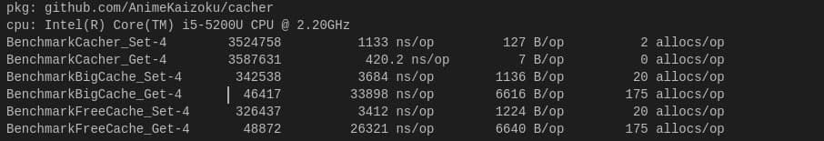
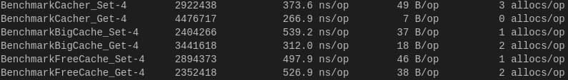

# Cacher 

Cacher is a fast, decentralised caching library, generic in nature and uses Go's built-in maps to store data. It has a plenty of features like TTL, Revaluation etc.

There are plenty examples available in the [examples](./examples) directory and cover almost every feature of the library with explanation and real life examples.

Support Go Versions: Go v1.18 and newer

[](https://pkg.go.dev/github.com/animekaizoku/cacher) [](http://perso.crans.org/besson/LICENSE.html)

## Key Highlights:
- **Decentralised**: Allows users to implement decentralised caching system which helps to perform multiple set-get operations parallely.
- **TTL (Time-To-Live)**: It allows us to expire a key after a specific time period.
- **Revaluation**: This is another useful feature that allows us to keep keys cached as per their usage frequency.
- **Zero Bloat**: Doesn't rely on any 3rd party library and only uses standard ones.
- **Structs Friendly**: You don't need to serialize your structs to bytes to save them as values, which makes the set-get process faster and allows us to write more readable code.
- **Well Documentated**: Cacher is very well documentated and contains examples in the docs wherever required. There are plenty of examples available in the [examples](./examples) directory to get a quick overview. 

## Getting Started
We have divided this section in several sub-sections, you can follow them sequentially to start using this library right now!

### Downloading the library
You can download it using the standard `go get` command:
```bash
go get github.com/AnimeKaizoku/cacher
```

### Basic Example
We will assume that you've already downloaded the library in your project as described in the previous section.
Now we will learn how to use it in your Go projects with the help of a basic example.

You can check-out examples directory for more detailed and well explained examples, here we will create just a basic program with a simple Cacher instance:
```golang 
package main

import "github.com/AnimeKaizoku/cacher"

var cache = cacher.NewCacher[int, string](nil)

func main() {
    cache.Set(1, "Value for 1 of type string")
    cache.Set(2, "Value for 2 of type string")

    valueOf1, ok := cache.Get(1)
    if !ok {
        println("value of 1 not found")
        return
    }
    println("value of 1 is:")
    println(valueOf1)
}
```

### Documentation and Examples
Cacher is a well-documentated library, and contains well explained examples with the help of real life cases which can be found out in [examples](./examples/) directory.

[Click here](https://pkg.go.dev/github.com/animekaizoku/cacher) to check-out documentations.

### Decentralised Usage
As we have already learnt how to create a simple Cacher instance, we can head towards our next step.

Decentralising means, distributing the work of a single central system to multiple systems. Since Cacher is a lightweight library, we can easily create new cacher instances for every level of our program. 

An example structure is shown below:
```
cacher1----module1.go---\
cacher2----module2.go----\
cacher3----module2.go-----} main.go
cacher4----module3.go----/
cacher5----module4.go---/
```
As we can see above, we have 5 modules in our program (module 1-5) where each of them have their own Cacher instance instead of a single caching instance we would've defined for our whole program. This approach allows us to distribute our load to multiple cachers which will help us to achieve better efficiency than we would have got from a single central cacher. This approach also allows us to use different Types of values for different modules.

## Benchmarks
We made comparision between 3 libraries, i.e. Cacher, BigCache, FreeCache and took benchmark tests in two different situations:

**Situation 1**: Serialisation needed

Above screenshot contains benchmark of the situation when you'll need to serialise your struct to bytes to store in BigCache/FreeCache, while you won't need to do that in case of Cacher since it uses Generics. 
We used "encoding/gob" for serialising the value struct to bytes


**Situation 2**: Serialisation not needed

Above screenshot contains benchmark of the situation when you won't need to serialise your value to bytes or we can say, serialisation time removed.

**Conclusion**: We can clearly see the difference. Although the libraries like BigCache and FreeCache act quickly without the serialisation time included, in practical life, you will **need to** serialise your date when attempting to cache structs while since Cacher uses Generic ability of Go, you won't need to serialise your data while using it and can just create a new cacher instance with your Value Type set as your struct's type.

## Contributing 
Contributions are always welcome! Just create a PR (Pull Request) with what you want to contribute with a brief description.

Please make sure to update examples as appropriate.

## License
[](https://www.gnu.org/licenses/gpl-3.0.en.html)
<br>Cacher is licensed under <a href="https://www.gnu.org/licenses/gpl-3.0.en.html">GNU General Public License v3</a>